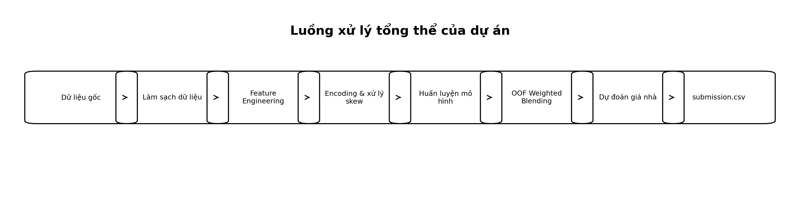
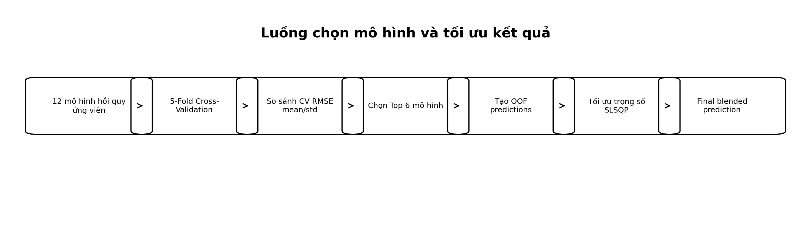
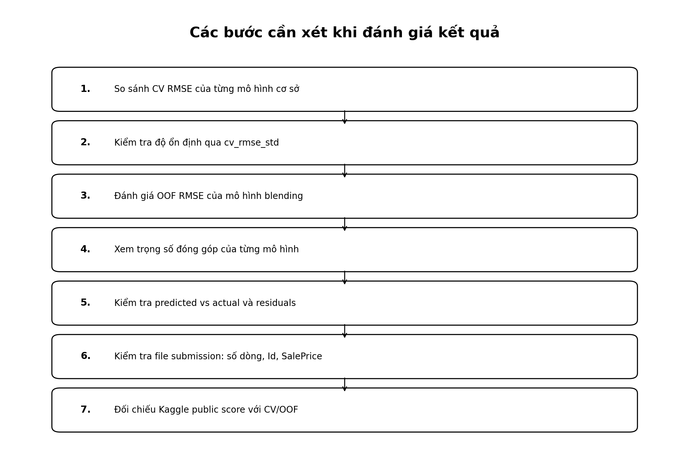
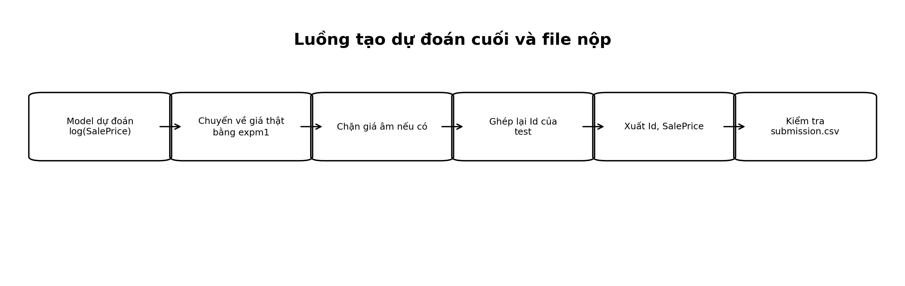

# House Prices - Advanced Regression Techniques

Dự án xây dựng mô hình học máy để dự đoán giá bán nhà (`SalePrice`) tại Ames, Iowa dựa trên các đặc trưng mô tả bất động sản dân dụng. Bài toán được triển khai trên bộ dữ liệu Kaggle **House Prices - Advanced Regression Techniques**, với dữ liệu dạng bảng gồm các thông tin về vị trí, diện tích, chất lượng nhà, tuổi nhà, tầng hầm, gara, tiện ích và điều kiện giao dịch.

Dự án tập trung vào một luồng xử lý hoàn chỉnh: từ dữ liệu gốc, khám phá dữ liệu, tiền xử lý, tạo đặc trưng mới, huấn luyện mô hình, đánh giá bằng cross-validation, kết hợp mô hình và tạo file dự đoán cuối cùng.

## 1. Mục tiêu dự án

Mục tiêu chính của dự án là xây dựng một pipeline học máy hoàn chỉnh để:

- Phân tích các yếu tố ảnh hưởng đến giá nhà.
- Tiền xử lý dữ liệu bất động sản dạng bảng.
- Tạo thêm đặc trưng mới bằng feature engineering.
- Huấn luyện và so sánh nhiều mô hình hồi quy.
- Kết hợp các mô hình tốt nhất bằng kỹ thuật OOF Weighted Blending.
- Tạo file `submission.csv` đúng định dạng Kaggle.

Đây là bài toán **regression**, vì biến cần dự đoán là `SalePrice`, một giá trị số liên tục.

## 2. Bộ dữ liệu

Dự án sử dụng 3 file chính:

| File | Vai trò |
|---|---|
| `train.csv` | Dữ liệu huấn luyện, gồm `Id`, 79 đặc trưng và biến mục tiêu `SalePrice` |
| `test.csv` | Dữ liệu cần dự đoán, gồm `Id` và 79 đặc trưng, không có `SalePrice` |
| `sample_submission.csv` | Mẫu định dạng file nộp Kaggle |

Mỗi bản ghi đại diện cho một giao dịch bán nhà tại Ames, Iowa. Các biến đầu vào mô tả nhiều khía cạnh của căn nhà, ví dụ:

- Vị trí và quy hoạch: `Neighborhood`, `MSZoning`
- Diện tích: `LotArea`, `GrLivArea`, `TotalBsmtSF`
- Chất lượng: `OverallQual`, `OverallCond`, `KitchenQual`
- Tuổi nhà: `YearBuilt`, `YearRemodAdd`
- Gara và tầng hầm: `GarageCars`, `GarageArea`, `BsmtQual`
- Điều kiện bán: `SaleType`, `SaleCondition`

## 3. Metric đánh giá

Kaggle đánh giá mô hình bằng **Root Mean Squared Error trên log giá nhà**:

```text
RMSE(log(y_pred), log(y_true))
```

Trong quá trình huấn luyện, biến mục tiêu được xử lý bằng:

```python
y = np.log1p(train_model["SalePrice"])
```

Sau khi mô hình dự đoán xong trên thang log, kết quả được chuyển về giá nhà thật bằng:

```python
sale_price_pred = np.expm1(prediction_log)
```

Lý do dùng log-transform:

- `SalePrice` có phân phối lệch phải.
- Một số căn nhà có giá rất cao có thể gây ảnh hưởng lớn đến lỗi dự đoán nếu dùng giá gốc.
- Log-transform giúp sai số giữa nhà giá thấp và nhà giá cao được tính công bằng hơn theo tỷ lệ.

## 4. Công nghệ sử dụng

Dự án sử dụng Python và các thư viện phổ biến cho phân tích dữ liệu, học máy và trực quan hóa.

### Xử lý dữ liệu

- `numpy`: tính toán số học.
- `pandas`: đọc dữ liệu, xử lý bảng, tạo feature, missing values và encoding.
- `scipy`: tính skewness và tối ưu trọng số ensemble.

### Trực quan hóa

- `matplotlib`: vẽ histogram, boxplot, bar chart, residual plot và các biểu đồ phục vụ phân tích.

### Machine Learning

- `scikit-learn`: preprocessing, train/validation split, KFold, cross-validation, pipeline và nhiều mô hình hồi quy.
- `xgboost`: mô hình XGBoost Regressor.
- `lightgbm`: mô hình LightGBM Regressor.
- `catboost`: mô hình CatBoost Regressor.

## 5. Luồng xử lý tổng thể



Pipeline chính của dự án gồm các bước:

```text
Raw Data
→ Data Cleaning
→ Feature Engineering
→ Encoding & Skew Handling
→ Model Training
→ OOF Weighted Blending
→ Prediction
→ submission.csv
```

Trong đó:

1. Đọc dữ liệu từ `train.csv`, `test.csv`, `sample_submission.csv`.
2. Kiểm tra chất lượng dữ liệu.
3. Loại outlier rõ ràng trong tập train.
4. Tách biến mục tiêu `SalePrice`.
5. Lưu lại `Id` của test để tạo file nộp.
6. Gộp train và test để xử lý feature đồng nhất.
7. Xử lý missing values.
8. Tạo feature mới.
9. Mã hóa biến phân loại.
10. Xử lý độ lệch phân phối của một số biến số.
11. Huấn luyện nhiều mô hình hồi quy.
12. Đánh giá bằng 5-fold cross-validation.
13. Chọn top model và kết hợp bằng OOF Weighted Blending.
14. Xuất file `submission.csv`.

## 6. Tiền xử lý dữ liệu

### 6.1. Xử lý biến mục tiêu

Biến `SalePrice` được chuyển sang thang log:

```python
y = np.log1p(train_model["SalePrice"])
```

Mục đích là giảm ảnh hưởng của các căn nhà có giá quá cao và phù hợp với metric của Kaggle.

### 6.2. Xử lý outlier

Các điểm bất thường rõ ràng trong tập train được loại bỏ, cụ thể là những căn nhà có:

```python
outlier_mask = (train_model["GrLivArea"] > 4000) & (train_model["SalePrice"] < 300000)
train_model = train_model.loc[~outlier_mask].reset_index(drop=True)
```

Lý do: đây là các căn có diện tích sinh hoạt rất lớn nhưng giá bán lại thấp bất thường, có thể làm mô hình học sai quan hệ giữa diện tích và giá.

### 6.3. Loại bỏ `Id` khỏi feature

`Id` không được dùng để huấn luyện mô hình vì đây chỉ là mã định danh, không mô tả đặc điểm căn nhà.

Tuy nhiên, `Id` của tập test vẫn được lưu lại để tạo file submission:

```python
test_ids = test["Id"].copy()

train_features = train_model.drop(columns=["Id", "SalePrice"])
test_features = test.drop(columns=["Id"])
```

Sau khi có dự đoán cuối:

```python
submission = pd.DataFrame({
    "Id": test_ids,
    "SalePrice": final_saleprice_pred
})
```

### 6.4. Xử lý lỗi logic

Có trường hợp `GarageYrBlt > YrSold`. Nếu năm xây gara lớn hơn năm bán nhà, giá trị này không hợp lý về mặt logic. Cách xử lý:

```python
invalid_garage_year = df["GarageYrBlt"] > df["YrSold"]
df.loc[invalid_garage_year, "GarageYrBlt"] = df.loc[invalid_garage_year, "YearBuilt"]
```

### 6.5. Ép kiểu dữ liệu

Một số biến có dạng số nhưng bản chất là biến phân loại, ví dụ:

- `MSSubClass`
- `MoSold`
- `YrSold`

Các biến này được chuyển sang dạng string để tránh việc mô hình hiểu nhầm rằng giá trị số lớn hơn có nghĩa là thứ bậc cao hơn.

```python
for col in ["MSSubClass", "MoSold", "YrSold"]:
    all_data[col] = all_data[col].astype(str)
```

## 7. Feature Engineering

Dự án tạo thêm nhiều đặc trưng mới từ các biến gốc để mô hình học tốt hơn.

| Feature mới | Công thức / cách tạo | Ý nghĩa |
|---|---|---|
| `TotalSF` | `TotalBsmtSF + 1stFlrSF + 2ndFlrSF` | Tổng diện tích sử dụng |
| `HouseAge` | `YrSold - YearBuilt` | Tuổi nhà tại thời điểm bán |
| `RemodAge` | `YrSold - YearRemodAdd` | Số năm từ lần cải tạo gần nhất |
| `TotalBath` | `FullBath + 0.5*HalfBath + BsmtFullBath + 0.5*BsmtHalfBath` | Tổng số phòng tắm quy đổi |
| `HasGarage` | 1 nếu có gara, 0 nếu không | Trạng thái có gara |
| `HasBasement` | 1 nếu có tầng hầm, 0 nếu không | Trạng thái có tầng hầm |
| `HasPool` | 1 nếu có hồ bơi, 0 nếu không | Trạng thái có hồ bơi |
| `HasFireplace` | 1 nếu có lò sưởi, 0 nếu không | Trạng thái có lò sưởi |
| `Has2ndFloor` | 1 nếu có tầng 2, 0 nếu không | Trạng thái có tầng hai |
| `OverallQual_TotalSF` | `OverallQual * TotalSF` | Tương tác giữa chất lượng và diện tích |

Đoạn code minh họa:

```python
all_data["TotalSF"] = all_data["TotalBsmtSF"] + all_data["1stFlrSF"] + all_data["2ndFlrSF"]
all_data["HouseAge"] = all_data["YrSold"].astype(int) - all_data["YearBuilt"]
all_data["RemodAge"] = all_data["YrSold"].astype(int) - all_data["YearRemodAdd"]

all_data["TotalBath"] = (
    all_data["FullBath"]
    + 0.5 * all_data["HalfBath"]
    + all_data["BsmtFullBath"]
    + 0.5 * all_data["BsmtHalfBath"]
)

all_data["HasGarage"] = (all_data["GarageArea"] > 0).astype(int)
all_data["HasBasement"] = (all_data["TotalBsmtSF"] > 0).astype(int)
all_data["HasPool"] = (all_data["PoolArea"] > 0).astype(int)
all_data["HasFireplace"] = (all_data["Fireplaces"] > 0).astype(int)
all_data["Has2ndFloor"] = (all_data["2ndFlrSF"] > 0).astype(int)

all_data["OverallQual_TotalSF"] = all_data["OverallQual"] * all_data["TotalSF"]
```

Các feature này được tạo dựa trên logic định giá bất động sản, không phải tạo ngẫu nhiên. Ví dụ, một căn nhà vừa rộng vừa có chất lượng cao thường có giá trị khác biệt hơn so với chỉ rộng hoặc chỉ có chất lượng cao.

## 8. Xử lý missing values

Dự án không xử lý tất cả missing values theo một cách duy nhất. Missing values được xử lý theo ý nghĩa của từng biến.

### 8.1. Điền `"None"`

Áp dụng cho các biến phân loại mà `NA` có nghĩa là không có hạng mục đó, ví dụ:

- Không có hồ bơi: `PoolQC`
- Không có hàng rào: `Fence`
- Không có hẻm phụ: `Alley`
- Không có tầng hầm: các biến `Bsmt...`
- Không có gara: các biến `Garage...`
- Không có lò sưởi: `FireplaceQu`

Đoạn code minh họa:

```python
none_cols = [
    "PoolQC", "MiscFeature", "Alley", "Fence", "FireplaceQu",
    "GarageType", "GarageFinish", "GarageQual", "GarageCond",
    "BsmtQual", "BsmtCond", "BsmtExposure", "BsmtFinType1", "BsmtFinType2"
]

for col in none_cols:
    all_data[col] = all_data[col].fillna("None")
```

### 8.2. Điền `0`

Áp dụng cho các biến số liên quan đến hạng mục không tồn tại, ví dụ:

- `GarageArea`
- `GarageCars`
- `BsmtFinSF1`
- `BsmtFinSF2`
- `TotalBsmtSF`
- `MasVnrArea`

```python
zero_cols = [
    "GarageArea", "GarageCars", "GarageYrBlt",
    "BsmtFinSF1", "BsmtFinSF2", "BsmtUnfSF", "TotalBsmtSF",
    "BsmtFullBath", "BsmtHalfBath",
    "MasVnrArea"
]

for col in zero_cols:
    all_data[col] = all_data[col].fillna(0)
```

### 8.3. Điền theo điều kiện

Với `LotFrontage`, giá trị thiếu được điền bằng median theo `Neighborhood`, vì chiều dài mặt tiền thường có liên hệ với khu vực. Nếu không có median theo khu vực, dùng median toàn bộ dữ liệu.

```python
all_data["LotFrontage"] = all_data.groupby("Neighborhood")["LotFrontage"].transform(
    lambda x: x.fillna(x.median())
)

all_data["LotFrontage"] = all_data["LotFrontage"].fillna(all_data["LotFrontage"].median())
```

### 8.4. Điền vét

Sau các bước trên:

- Cột numeric còn thiếu được điền bằng median.
- Cột categorical còn thiếu được điền bằng mode.

```python
for col in all_data.columns:
    if all_data[col].isna().sum() > 0:
        if all_data[col].dtype == "object":
            all_data[col] = all_data[col].fillna(all_data[col].mode()[0])
        else:
            all_data[col] = all_data[col].fillna(all_data[col].median())
```

## 9. Mã hóa dữ liệu

### 9.1. Ordinal Encoding

Áp dụng cho các biến phân loại có thứ bậc rõ ràng.

Ví dụ nhóm chất lượng:

```text
Ex = 5
Gd = 4
TA = 3
Fa = 2
Po = 1
None = 0
```

Đoạn code minh họa:

```python
quality_map = {
    "Ex": 5,
    "Gd": 4,
    "TA": 3,
    "Fa": 2,
    "Po": 1,
    "None": 0
}

quality_cols = [
    "ExterQual", "ExterCond", "BsmtQual", "BsmtCond",
    "HeatingQC", "KitchenQual", "FireplaceQu",
    "GarageQual", "GarageCond", "PoolQC"
]

for col in quality_cols:
    all_data[col] = all_data[col].map(quality_map).fillna(0)
```

### 9.2. One-Hot Encoding

Áp dụng cho các biến phân loại không có thứ bậc tự nhiên, ví dụ:

- `Neighborhood`
- `MSZoning`
- `RoofStyle`
- `SaleType`
- `SaleCondition`

```python
all_data = pd.get_dummies(all_data)
```

Sau khi xử lý, số lượng đặc trưng tăng lên khoảng 270 cột.

## 10. Xử lý độ lệch phân phối của feature

Sau khi mã hóa, các biến số được kiểm tra độ lệch bằng `skew()`.

Chỉ các biến thỏa mãn điều kiện sau mới được xét:

- Là biến numeric.
- Có số giá trị duy nhất lớn hơn 20.
- Giá trị nhỏ nhất không âm.
- `skew > 0.75`.

Với các biến bị lệch phải mạnh, áp dụng:

```python
np.log1p(x)
```

Đoạn code minh họa:

```python
from scipy.stats import skew

numeric_cols = all_data.select_dtypes(include=[np.number]).columns

skewed_features = []
for col in numeric_cols:
    if all_data[col].nunique() > 20 and all_data[col].min() >= 0:
        col_skew = skew(all_data[col])
        if col_skew > 0.75:
            skewed_features.append(col)

for col in skewed_features:
    all_data[col] = np.log1p(all_data[col])
```

Mục tiêu là nén các giá trị quá lớn và giúp mô hình học ổn định hơn.

## 11. Các mô hình được sử dụng

Dự án xây dựng một kho gồm 12 mô hình hồi quy ứng viên.

### 11.1. Nhóm hồi quy tuyến tính có regularization

#### Ridge Regression

Ridge là mô hình hồi quy tuyến tính có điều chuẩn L2. Mô hình này giúp giảm độ lớn của hệ số, từ đó hạn chế overfitting khi số lượng feature lớn.

```python
Ridge(alpha=10.0)
```

#### Lasso Regression

Lasso là mô hình hồi quy tuyến tính có điều chuẩn L1. Lasso có khả năng đưa một số hệ số về 0, giúp mô hình thực hiện lựa chọn đặc trưng ở mức cơ bản.

```python
Lasso(alpha=0.0005, max_iter=50000)
```

#### ElasticNet

ElasticNet kết hợp cả L1 và L2 regularization. Mô hình này cân bằng giữa khả năng chọn biến của Lasso và sự ổn định của Ridge.

```python
ElasticNet(alpha=0.0007, l1_ratio=0.9, max_iter=50000)
```

#### Bayesian Ridge

BayesianRidge là hồi quy tuyến tính theo hướng Bayesian. Mô hình ước lượng phân phối xác suất của các hệ số thay vì chỉ tìm một giá trị cố định.

```python
BayesianRidge()
```

### 11.2. Nhóm mô hình Kernel

#### Kernel Ridge

KernelRidge mở rộng Ridge Regression bằng kernel để học các quan hệ phi tuyến giữa feature và giá nhà.

```python
KernelRidge(alpha=0.6, kernel="polynomial", degree=2, coef0=2.5)
```

### 11.3. Nhóm cây quyết định và bagging

#### Random Forest Regressor

RandomForest là ensemble của nhiều cây quyết định. Mỗi cây học trên các mẫu và tập feature ngẫu nhiên, giúp giảm variance so với một cây đơn lẻ.

```python
RandomForestRegressor(
    n_estimators=600,
    max_features="sqrt"
)
```

#### Extra Trees Regressor

ExtraTrees cũng là ensemble của nhiều cây, nhưng tăng thêm tính ngẫu nhiên trong quá trình chia nhánh. Mục tiêu là giảm overfitting và tăng tính đa dạng giữa các cây.

```python
ExtraTreesRegressor(
    n_estimators=600,
    max_features="sqrt"
)
```

### 11.4. Nhóm boosting

#### Gradient Boosting Regressor

GradientBoosting xây các cây nhỏ theo tuần tự, trong đó cây sau học để sửa lỗi của các cây trước. Đây là mô hình có hiệu năng tốt nhất theo cross-validation.

```python
GradientBoostingRegressor(
    n_estimators=1800,
    learning_rate=0.025,
    max_depth=3,
    loss="huber"
)
```

#### HistGradientBoosting Regressor

HistGradientBoosting là phiên bản boosting dùng histogram để tăng tốc quá trình huấn luyện trên dữ liệu dạng bảng.

```python
HistGradientBoostingRegressor(
    max_iter=1000,
    learning_rate=0.025,
    max_leaf_nodes=31
)
```

#### XGBoost Regressor

XGBoost là thư viện gradient boosting mạnh, phổ biến với dữ liệu dạng bảng. Mô hình có regularization và nhiều cơ chế tối ưu giúp đạt hiệu năng cao.

```python
XGBRegressor(
    n_estimators=1800,
    learning_rate=0.025,
    max_depth=3,
    subsample=0.8,
    colsample_bytree=0.8
)
```

#### LightGBM Regressor

LightGBM là mô hình gradient boosting tối ưu về tốc độ, thường hiệu quả với dữ liệu dạng bảng có nhiều feature.

```python
LGBMRegressor(
    n_estimators=2500,
    learning_rate=0.015,
    num_leaves=31
)
```

#### CatBoost Regressor

CatBoost là mô hình boosting có thế mạnh trong xử lý dữ liệu bảng và biến phân loại. Trong dự án này, dữ liệu đã được encoding trước khi đưa vào mô hình.

```python
CatBoostRegressor(
    iterations=2500,
    learning_rate=0.02,
    depth=4,
    loss_function="RMSE"
)
```

## 12. RobustScaler và Pipeline

Các mô hình tuyến tính và KernelRidge được đưa vào `Pipeline` cùng `RobustScaler`.

```python
Pipeline([
    ("scaler", RobustScaler()),
    ("model", model)
])
```

`RobustScaler` scale dữ liệu dựa trên median và IQR, nên ít bị ảnh hưởng bởi outlier hơn so với StandardScaler. Điều này phù hợp với dữ liệu bất động sản, nơi một số biến như diện tích hoặc giá trị có thể có đuôi dài.

## 13. Cross-Validation

Dự án sử dụng 5-fold cross-validation:

```python
KFold(
    n_splits=5,
    shuffle=True,
    random_state=42
)
```

Cách hoạt động:

- Dữ liệu train được chia thành 5 phần gần bằng nhau.
- Mỗi lần dùng 4 phần để train và 1 phần để validation.
- Quá trình lặp lại 5 lần.
- Mỗi dòng train được làm validation đúng một lần.

Metric nội bộ:

```python
RMSE trên log1p(SalePrice)
```

Mỗi model được đánh giá bằng:

- `cv_rmse_mean`: RMSE trung bình qua 5 fold.
- `cv_rmse_std`: độ dao động RMSE giữa các fold.
- `time_seconds`: thời gian chạy.
- `fold_1` đến `fold_5`: điểm từng fold.

Đoạn code minh họa:

```python
from sklearn.model_selection import KFold
from sklearn.metrics import mean_squared_error
from sklearn.base import clone

kf = KFold(n_splits=5, shuffle=True, random_state=42)

def rmse(y_true, y_pred):
    return np.sqrt(mean_squared_error(y_true, y_pred))

scores = []

for fold, (train_idx, valid_idx) in enumerate(kf.split(X), start=1):
    X_train, X_valid = X.iloc[train_idx], X.iloc[valid_idx]
    y_train, y_valid = y.iloc[train_idx], y.iloc[valid_idx]

    model_fold = clone(model)
    model_fold.fit(X_train, y_train)

    valid_pred = model_fold.predict(X_valid)
    fold_rmse = rmse(y_valid, valid_pred)
    scores.append(fold_rmse)

cv_rmse_mean = np.mean(scores)
cv_rmse_std = np.std(scores)
```

## 14. Luồng chọn mô hình và tối ưu kết quả



Các mô hình được chạy độc lập trước để lấy điểm cross-validation. Sau đó, kết quả được sắp xếp theo `cv_rmse_mean`.

Top mô hình gồm:

| Model | CV RMSE Mean |
|---|---:|
| GradientBoosting | 0.10796 |
| CatBoost | 0.11115 |
| Lasso | 0.11131 |
| ElasticNet | 0.11153 |
| XGBoost | 0.11189 |
| BayesianRidge | 0.11332 |

Các model này được chọn cho bước OOF Weighted Blending.

## 15. OOF Weighted Blending

OOF là viết tắt của **Out-of-Fold**.

Thay vì train một model trên toàn bộ train rồi tự dự đoán lại train, OOF tạo dự đoán cho mỗi dòng train bằng một model chưa từng học trên dòng đó. Điều này giúp đánh giá ensemble công bằng hơn và giảm rủi ro rò rỉ dữ liệu.

Quy trình OOF:

1. Chọn top 6 model theo cross-validation.
2. Với mỗi model:
   - Chạy lại 5-fold.
   - Mỗi fold train trên 4 phần và dự đoán phần validation còn lại.
   - Lưu prediction vào ma trận `oof_preds`.
   - Đồng thời dự đoán trên `X_test_final`.
3. Trung bình 5 lần dự đoán test để có prediction test của từng model.
4. Tối ưu trọng số blend bằng `scipy.optimize.minimize`.

Công thức dự đoán cuối:

```text
final_prediction =
w1 * pred_model_1
+ w2 * pred_model_2
+ ...
+ wk * pred_model_k
```

Điều kiện ràng buộc:

```text
0 <= wi <= 1
sum(wi) = 1
```

## 16. Tối ưu trọng số bằng SLSQP

Dự án dùng:

```python
scipy.optimize.minimize(method="SLSQP")
```

Mục tiêu là tìm bộ trọng số làm RMSE trên OOF thấp nhất.

Đoạn code minh họa:

```python
from scipy.optimize import minimize

def blend_rmse(weights, oof_matrix, y_true):
    blended = np.dot(oof_matrix, weights)
    return np.sqrt(mean_squared_error(y_true, blended))

n_models = oof_matrix.shape[1]

initial_weights = np.ones(n_models) / n_models
bounds = [(0, 1)] * n_models
constraints = {
    "type": "eq",
    "fun": lambda w: np.sum(w) - 1
}

result = minimize(
    blend_rmse,
    initial_weights,
    args=(oof_matrix, y),
    method="SLSQP",
    bounds=bounds,
    constraints=constraints
)

best_weights = result.x
```

Kết quả trọng số tối ưu:

| Model | Weight |
|---|---:|
| GradientBoosting | 0.4746 |
| Lasso | 0.1994 |
| ElasticNet | 0.1742 |
| XGBoost | 0.1215 |
| CatBoost | 0.0304 |
| BayesianRidge | 0.0000 |

Ý nghĩa:

- GradientBoosting đóng góp lớn nhất trong ensemble.
- Lasso và ElasticNet bổ sung sự ổn định từ nhóm linear models.
- XGBoost đóng góp thêm khả năng học phi tuyến.
- CatBoost có trọng số nhỏ hơn.
- BayesianRidge có trọng số 0, nghĩa là khi kết hợp với các model khác, nó không giúp giảm thêm RMSE.

OOF Blend RMSE đạt khoảng:

```text
0.1059
```

## 17. Các bước cần xét khi đánh giá kết quả



Khi đánh giá kết quả, không nên chỉ nhìn một con số duy nhất. Cần xem toàn bộ luồng sau:

1. **CV RMSE của từng mô hình cơ sở**  
   Dùng để biết model nào tốt hơn khi chạy độc lập.

2. **Độ ổn định qua `cv_rmse_std`**  
   Nếu mean thấp nhưng std cao, model có thể thiếu ổn định giữa các fold.

3. **OOF RMSE của mô hình blending**  
   Dùng để xem việc kết hợp model có thật sự cải thiện lỗi so với model đơn lẻ hay không.

4. **Trọng số đóng góp của từng mô hình**  
   Dùng để hiểu ensemble đang tin vào model nào nhiều hơn.

5. **Predicted vs Actual**  
   Dùng để quan sát dự đoán có bám sát giá trị thật trên tập validation/OOF hay không.

6. **Residual Plot**  
   Dùng để kiểm tra sai số có tập trung quanh 0 hay xuất hiện pattern bất thường.

7. **Submission validation**  
   Kiểm tra file nộp có đủ dòng, đúng cột, không missing và không có giá âm.

8. **Kaggle Public Score**  
   Dùng như một tín hiệu bên ngoài, nhưng không thay thế hoàn toàn cross-validation nội bộ.

## 18. Đoạn code kiểm tra kết quả

### 18.1. Bảng so sánh model

```python
cv_results = cv_results.sort_values("cv_rmse_mean")

display(cv_results[[
    "model",
    "cv_rmse_mean",
    "cv_rmse_std",
    "time_seconds"
]])
```

### 18.2. Biểu đồ so sánh model

```python
plt.figure(figsize=(10, 6))
plt.barh(cv_results["model"], cv_results["cv_rmse_mean"])
plt.xlabel("CV RMSE on log(SalePrice)")
plt.ylabel("Model")
plt.title("Model Comparison by 5-Fold Cross-Validation RMSE")
plt.gca().invert_yaxis()
plt.show()
```

### 18.3. Kiểm tra OOF RMSE

```python
oof_blend_pred = np.dot(oof_matrix, best_weights)
oof_blend_rmse = np.sqrt(mean_squared_error(y, oof_blend_pred))

print("OOF Blend RMSE:", oof_blend_rmse)
```

### 18.4. Kiểm tra trọng số ensemble

```python
weights_df = pd.DataFrame({
    "model": top_model_names,
    "weight": best_weights
}).sort_values("weight", ascending=False)

display(weights_df)
```

```python
plt.figure(figsize=(8, 5))
plt.barh(weights_df["model"], weights_df["weight"])
plt.xlabel("Weight")
plt.ylabel("Model")
plt.title("Final OOF Blending Weights")
plt.gca().invert_yaxis()
plt.show()
```

### 18.5. Predicted vs Actual

```python
plt.figure(figsize=(6, 6))
plt.scatter(y, oof_blend_pred, alpha=0.5)
plt.xlabel("Actual log1p(SalePrice)")
plt.ylabel("Predicted log1p(SalePrice)")
plt.title("Predicted vs Actual")
plt.show()
```

### 18.6. Residual Plot

```python
residuals = y - oof_blend_pred

plt.figure(figsize=(8, 5))
plt.scatter(oof_blend_pred, residuals, alpha=0.5)
plt.axhline(0, linestyle="--")
plt.xlabel("Predicted log1p(SalePrice)")
plt.ylabel("Residuals")
plt.title("Residual Plot")
plt.show()
```

### 18.7. Kiểm tra file submission

```python
print(submission.shape)
print(submission.head())
print(submission.isna().sum())
print((submission["SalePrice"] < 0).sum())

assert list(submission.columns) == ["Id", "SalePrice"]
assert submission["Id"].is_unique
assert submission["SalePrice"].isna().sum() == 0
assert (submission["SalePrice"] >= 0).all()
```

## 19. Tạo submission



Sau khi có prediction cuối trên thang log:

```python
final_saleprice_pred = np.expm1(final_log_pred)
```

Đảm bảo giá không âm:

```python
final_saleprice_pred = np.maximum(final_saleprice_pred, 0)
```

File nộp được tạo với hai cột:

```text
Id,SalePrice
```

Đoạn code:

```python
submission = pd.DataFrame({
    "Id": test_ids,
    "SalePrice": final_saleprice_pred
})

submission.to_csv("submission.csv", index=False)
```

## 20. Kết quả Kaggle

Kết quả public leaderboard của dự án:

| Metric | Value |
|---|---:|
| Public score | 0.12643 |
| Rank | 756 |
| Total teams | 5126 |
| Top percentage | 14.75% |

Kết quả này cho thấy mô hình đạt mức cạnh tranh tốt trong leaderboard public của Kaggle. Tuy nhiên, public score không nên được xem là bằng chứng duy nhất về chất lượng mô hình, vì leaderboard chỉ phản ánh một phần tập test. Cross-validation và OOF RMSE vẫn là cơ sở nội bộ quan trọng để đánh giá độ ổn định.

## 21. Hướng cải thiện

Một số hướng có thể cải thiện mô hình trong tương lai:

### 21.1. Hyperparameter Tuning

Sử dụng Optuna để tự động tìm tham số tối ưu cho:

- GradientBoosting
- XGBoost
- LightGBM
- CatBoost

### 21.2. SHAP Explainability

Dùng SHAP để giải thích mô hình:

- Biến nào ảnh hưởng mạnh nhất đến dự đoán?
- Một căn nhà cụ thể được dự đoán cao/thấp vì lý do gì?
- Có thể loại bỏ dummy variables ít quan trọng để giảm nhiễu không?

### 21.3. Stacking

Thay vì weighted blending tuyến tính, có thể dùng stacking với meta-model để học cách kết hợp prediction của nhiều model ở tầng thứ hai.

### 21.4. Dữ liệu mở rộng

Có thể bổ sung:

- Dữ liệu vĩ mô: lãi suất vay thế chấp, tình hình thị trường bất động sản 2006–2010.
- Dữ liệu địa lý: khoảng cách đến trung tâm, trường học, bệnh viện, giao thông.
- Spatial clustering: gom cụm `Neighborhood` theo mặt bằng giá hoặc đặc điểm khu vực.

## 22. Cấu trúc file gợi ý cho repository

```text
.
├── README.md
├── group7.ipynb
├── data_description.txt
├── submission.csv
├── cv_results.csv
├── figures/
│   ├── 01_end_to_end_pipeline.png
│   ├── 02_model_selection_flow.png
│   ├── 03_result_evaluation_checklist.png
│   └── 04_submission_flow.png
└── data/
    ├── train.csv
    ├── test.csv
    └── sample_submission.csv
```

## 23. Kết luận

Dự án triển khai một pipeline hoàn chỉnh cho bài toán dự đoán giá nhà:

- Dữ liệu được khám phá và làm sạch.
- Missing values được xử lý theo ý nghĩa nghiệp vụ.
- Các feature mới được tạo dựa trên logic bất động sản.
- Dữ liệu được encoding và xử lý skew.
- 12 mô hình hồi quy được huấn luyện và đánh giá bằng 5-fold cross-validation.
- Top 6 model được kết hợp bằng OOF Weighted Blending.
- Kết quả cuối cùng được xuất thành `submission.csv` để nộp Kaggle.

Dự án không chỉ tập trung vào điểm số, mà còn thể hiện quy trình phân tích dữ liệu và mô hình hóa có thể áp dụng trong bài toán định giá bất động sản thực tế.
